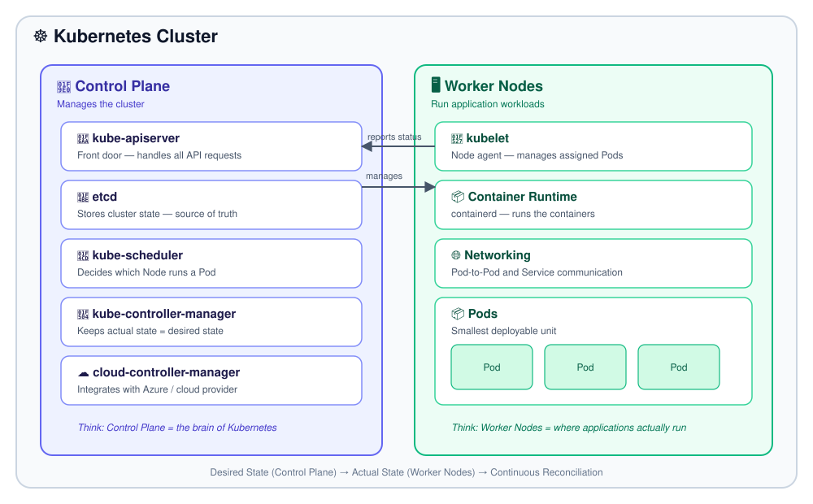

# ☸️ Kubernetes Engineering Notes

### Architecture, production troubleshooting, and AKS — documented from hands-on work

Control Plane • Worker Nodes • API Server • etcd • Scheduler • Controllers • kubelet • Container Runtime

---

## 📖 About This Repository

This is where I document Kubernetes as I learn and work with it in production — starting with architecture, since everything else builds on top of it.

Every time I hit a real issue on a cluster, I come back and add what I learned. The repository grows the same way production experience does: one incident, one concept, one fix at a time.

```text
Kubernetes Architecture
        ↓
Work With Real Clusters
        ↓
Hit a Problem
        ↓
Understand It
        ↓
Document It Here
        ↓
Repository Grows
```

## 🎯 Goals

- 📚 Learn Kubernetes deeply — from core concepts to production operations
- 🧠 Build a long-term reference — stop re-learning the same concepts from scratch
- 💼 Demonstrate production skills — architecture, AKS, scaling, networking, troubleshooting, and CI/CD

## 🧩 What This Repository Covers

- 🏗️ **Kubernetes architecture** — control plane, worker nodes, and how they communicate
- ☁️ **AKS in production** — node pools, scaling, and cluster operations on Azure
- 🐛 **Troubleshooting** — root-causing failed deployments, crash loops, and resource issues
- 🔁 **CI/CD** — how code goes from a Git push to a running Pod

This is the first piece: **Kubernetes Architecture**. It's the foundation every other topic here — networking, scaling, security, AKS — connects back to.


---

## 📖 What Is Kubernetes?

Kubernetes is a **container orchestration platform** used to deploy, manage, scale, and maintain containerized applications across a cluster of machines.

Instead of manually managing containers on individual servers, Kubernetes continuously reconciles the application toward a **desired state** defined by the user.

```text
Application
     ↓
Container
     ↓
Pod
     ↓
Worker Node
     ↓
Kubernetes Cluster
```

The architecture is mainly divided into two parts:

```text
                    ☸️ Kubernetes Cluster
                            │
              ┌─────────────┴─────────────┐
              │                           │
              ▼                           ▼
        🧠 Control Plane             🖥️ Worker Nodes
        Manages Cluster              Runs Workloads
```

---

## 🏛️ Kubernetes Cluster

A Kubernetes Cluster is a group of machines working together to run and manage containerized applications.

The cluster contains:

- **Control Plane** — responsible for managing the cluster.
- **Worker Nodes** — responsible for running application workloads.

Worker Nodes can be organized into Node Pools, especially in managed Kubernetes platforms such as AKS.

```text
Kubernetes Cluster
        │
        ├── Control Plane
        │
        └── Node Pool
              │
              ├── Worker Node
              │     └── Pods
              │
              ├── Worker Node
              │     └── Pods
              │
              └── Worker Node
                    └── Pods
```

---

## 🧠 Control Plane

The Control Plane is the management layer of Kubernetes.

It receives instructions, stores the cluster state, decides where workloads should run, and continuously works to maintain the desired state.

```text
Control Plane
│
├── kube-apiserver
├── etcd
├── kube-scheduler
├── kube-controller-manager
└── cloud-controller-manager
```

> **Think:** The Control Plane is the brain of the Kubernetes cluster.

### 🚪 kube-apiserver

The API Server is the central entry point into Kubernetes.

When we use commands such as:

```bash
kubectl get pods
kubectl apply -f deployment.yaml
kubectl delete pod <pod-name>
```

the requests are handled through the Kubernetes API.

```text
Developer
    ↓
kubectl
    ↓
API Server
    ↓
Kubernetes Cluster
```

The API Server also acts as the main communication point between Kubernetes components.

> **Think:** API Server = Front door and communication layer of Kubernetes

### 💾 etcd

etcd is the distributed key-value store used by Kubernetes to persist cluster state.

It stores information about Kubernetes objects and their configuration — Pods, Deployments, Services, Nodes, Namespaces, Secrets, and ConfigMaps.

```text
                    etcd
                     │
        ┌────────────┼────────────┐
        ▼            ▼            ▼
   Cluster State   Objects     Configuration
```

The API Server communicates with etcd to store and retrieve cluster information.

> **Think:** etcd = Source of truth for Kubernetes cluster state

### 📍 kube-scheduler

The Scheduler decides which Worker Node should run a newly created Pod.

```text
New Pod
   ↓
Scheduler
   ↓
Evaluate Nodes
   ↓
Select Suitable Node
```

The Scheduler considers factors such as available resources and scheduling requirements. It does **not** run the container itself — it only determines *where* the Pod should run.

> **Think:** Scheduler = Decides WHERE the Pod runs

### 🔄 kube-controller-manager

Kubernetes uses controllers to continuously compare the desired state with the actual state of the cluster.

```text
Desired State
      ↓
   Controller
      ↓
Actual State
```

For example:

```text
Desired: 2 Pods
Actual:  1 Pod
      ↓
Controller detects difference
      ↓
Replacement Pod created
      ↓
Actual: 2 Pods
```

This continuous reconciliation is one of the fundamental ideas behind Kubernetes.

> **Think:** Controllers = Continuously work toward the desired state

### ☁️ cloud-controller-manager

The Cloud Controller Manager provides integration between Kubernetes and the underlying cloud provider.

```text
Kubernetes
     ↓
Cloud Controller Manager
     ↓
Azure
```

This becomes particularly important when working with Azure Kubernetes Service (AKS).

---

## 🖥️ Worker Nodes

Worker Nodes are the machines where application workloads actually run.

```text
Worker Node
│
├── kubelet
├── Container Runtime
├── Networking Components
└── Pods
```

A Kubernetes cluster normally has multiple Worker Nodes so workloads can be distributed across the cluster.

```text
                 Worker Nodes
                      │
        ┌─────────────┼─────────────┐
        ▼             ▼             ▼
      Node 1        Node 2        Node 3
        │             │             │
       Pods          Pods          Pods
```

### 🔧 kubelet

kubelet is the Kubernetes agent running on every Worker Node.

It communicates with the Control Plane and makes sure that the workloads assigned to its Node are running correctly.

```text
Control Plane
      ↓
  API Server
      ↓
    kubelet
      ↓
Container Runtime
      ↓
     Pod
```

The kubelet does not decide which Node should receive a Pod — that decision is made by the Scheduler.

> **Think:** kubelet = Agent responsible for managing workloads on a Node

### 📦 Container Runtime

The Container Runtime is responsible for actually running containers on the Worker Node. A common runtime used by Kubernetes is **containerd**.

```text
kubelet
   ↓
Container Runtime
   ↓
Container
```

Therefore:

```text
Scheduler          → Decides WHERE
kubelet             → Manages the workload
Container Runtime   → Runs the container
```

### 📦 Pods

A Pod is the smallest deployable unit in Kubernetes. It contains one or more containers that share the same network and storage context.

```text
Worker Node
│
├── Pod
│    └── Container
│
├── Pod
│    └── Container
│
└── Pod
     └── Container
```

Kubernetes schedules **Pods**, not individual containers, onto Worker Nodes.

---

## 🔄 Complete Kubernetes Flow

When we deploy an application, the major flow can be understood as:

```text
Developer
    ↓
kubectl / API Client
    ↓
API Server
    ↓
etcd
    ↓
Controllers
    ↓
Scheduler
    ↓
Selected Worker Node
    ↓
kubelet
    ↓
Container Runtime
    ↓
Pod
    ↓
Container
    ↓
Application
```

Each component has a specific responsibility in this process — no single piece does everything.

---

## 🧩 Complete Architecture

```text
                         ☸️ KUBERNETES CLUSTER
                                  │
                  ┌───────────────┴───────────────┐
                  │                               │
                  ▼                               ▼
           🧠 CONTROL PLANE                🖥️ WORKER NODES
                  │                               │
       ┌──────────┼──────────┐            ┌───────┼────────┐
       │          │          │            │       │        │
      API        etcd    Scheduler      kubelet Runtime  Network
     Server
       │
       ▼
  Controllers
       │
       └──────────────────────────────┐
                                      ▼
                                    Pod
                                      │
                                      ▼
                                  Container
                                      │
                                      ▼
                                  Application
```

---

## 🧠 Responsibility Map

| Component | Responsibility |
|---|---|
| Control Plane | Manages the Kubernetes cluster |
| API Server | Handles Kubernetes API requests and communication |
| etcd | Stores cluster state |
| Scheduler | Decides where Pods should run |
| Controllers | Maintain the desired state |
| Cloud Controller | Integrates Kubernetes with cloud infrastructure |
| Worker Node | Provides compute for workloads |
| kubelet | Manages Pods on the Node |
| Container Runtime | Runs containers |
| Pod | Smallest deployable workload unit |

---

## 🏗️ Kubernetes Hierarchy

```text
Cloud / Infrastructure
        ↓
Kubernetes Cluster
        ↓
Node Pool
        ↓
Worker Node
        ↓
Namespace
        ↓
Workload
        ↓
Pod
        ↓
Container
```

For AKS:

```text
Azure Resource Group
        ↓
AKS Cluster
        ↓
Node Pool
        ↓
Worker Nodes
        ↓
Pods
        ↓
Containers
```

Each layer has a different responsibility and should not be treated as the same thing.

---

## 🔁 Desired State & Actual State

Kubernetes is built around the concept of **desired state**.

```yaml
Desired State:
  replicas: 2
```

Kubernetes continuously works to make the actual cluster state match that requirement.

```text
                 Desired State
                      │
                      ▼
                 Kubernetes
                      │
                      ▼
                  Actual State
```

If one Pod fails:

```text
Desired = 2
Actual  = 1
       ↓
Kubernetes detects the difference
       ↓
Works to restore the desired state
       ↓
Desired = 2
Actual  = 2
```

This reconciliation model is fundamental to understanding Deployments, self-healing, scaling, and most other Kubernetes behavior.

---

## 🎯 Core Concepts, In One Line Each

```text
API Server         → Communication
etcd                → Cluster State
Controllers         → Desired State
Scheduler           → Pod Placement
kubelet             → Node Workload Management
Container Runtime   → Container Execution
Pod                 → Application Workload
```

---

## 📚 Roadmap — Topics To Be Added

This repository starts with **Kubernetes Architecture** as the foundation. The following topics will be added progressively as separate sections, each building on the concepts covered here.

```text
☸️ Kubernetes Architecture   ✅ (this section)
        │
        ├── Pods & Workloads
        ├── Deployments & ReplicaSets
        ├── Services & Ingress
        ├── Networking & DNS
        ├── Scheduling, Affinity & Topology
        ├── Scaling (HPA / VPA / Cluster Autoscaler)
        ├── Storage (PV / PVC / StorageClass)
        ├── Security (RBAC / Secrets / Workload Identity)
        ├── Health Probes
        ├── Observability (Logs / Metrics / Events)
        ├── Troubleshooting Playbooks
        ├── Azure Kubernetes Service (AKS)
        ├── CI/CD (Azure DevOps → ACR → AKS)
        └── Production Incidents & Lessons Learned
```

Every topic will follow the same format used here — short explanations, mental models, and diagrams — so the repository stays consistent as it grows.

---

## 🚀 Learning Approach

The goal of this repository is not to memorize Kubernetes commands.

The goal is to understand how Kubernetes works internally, apply that knowledge to real environments, troubleshoot problems, and document the solutions for future reference.

```text
Understand Architecture
        ↓
Understand Components
        ↓
Understand Workloads
        ↓
Understand Communication
        ↓
Practice with Kubernetes
        ↓
Troubleshoot Real Problems
        ↓
Apply in AKS
        ↓
Production Kubernetes
```

☸️ **Learn → Understand → Practice → Troubleshoot → Document → Improve**
